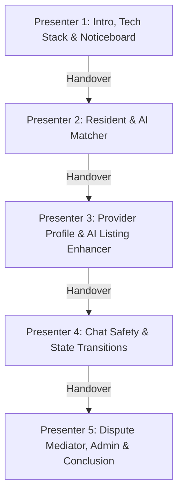

# Neighbours Hub: Live Demo & 5-Member Presentation Scripts (Roman Urdu)

This document provides a complete, step-by-step UI action guide and word-for-word spoken script in **Roman Urdu** for a **5-member group presentation**. Each presenter takes charge of specific roles and features to ensure 100% of the platform's capabilities are covered in an engaging, collaborative flow.

---

## Group Presentation Overview & Division

* **Presenter 1**: Introduction, Project Mission, Technology Stack, Noticeboard & Pinned Announcements, Switcher Introduction.
* **Presenter 2**: Resident Search, AI Smart Matchmaking, Trust Profile Sentiment Summarization, Booking Request.
* **Presenter 3**: Provider Profile Dashboard, statistics metrics (Response rates/times), AI Service Listing Enhancer.
* **Presenter 4**: WebSocket Messaging, Chat Bypass Security Auditing, Booking Workflow Pipeline (Sent → Accepted → In Progress → Completed).
* **Presenter 5**: Dispute Center, AI Dispute Mediator Assistant, Admin Console (Analytics, User Verifications, Zone configurations), Conclusion.

---

## 🎙️ Presenter 1: Introduction, Tech Stack & Community Noticeboard

### 🖥️ UI Actions & Live Navigation (English)
1. Open your browser and navigate to `http://localhost:5173/`. 
2. Start on the **Login Page**. Point to the floating **Demo Role Switcher** widget on the bottom right.
3. Click the Switcher and select **Jane Doe (Resident)**. 
4. Click **Noticeboard** in the navigation bar.
5. Point to the **Summer Festival** post (which is pinned at the top with a pushpin icon).
6. Point to the comments section below the post showing **Hassan Syed** and **Jane Doe** chatting.
7. Click **Write a comment...** and type: *"Can't wait to see the booths!"* then click the send icon.

---

### 🗣️ Spoken Script (Roman Urdu)
> *"Assalam-o-Alaikum, members of the jury aur dosto. Aaj humari group **Neighbours Hub** ka live demo present karne ja rahi hai, jo ke aik AI-powered hyperlocal services marketplace hai. Is platform ka maqsad local residents ko un ke qareeb ke trusted aur verified service providers se connect karna hai.*
>
> *Technical architecture ki baat karein to hum ne frontend ke liye **React (TypeScript) aur Material-UI** use kiya hai, backend ke liye **NestJS** use kiya hai, aur database mapping ke liye **Prisma ORM** ke sath **PostgreSQL** ka istemal kiya hai. Real-time updates ke liye hum ne **Socket.io** integration ki hai aur advanced AI features ke liye **OpenAI GPT-4o API** use kiya hai.*
>
> *Apni presentation ko smoothly dikhane ke liye, hum ne screen ke bottom right par aik floating **Demo Role Switcher** widget banaya hai. Is se hum bina log out kiye instantly different accounts (Resident, Provider, Moderator, aur Admin) ke darmiyan switch kar sakte hain.*
>
> *Main abhi **Jane Doe (Resident)** ke account se logged in hoon. Sab se pehle, hum **Community Noticeboard** dekhte hain, jahan moderators pinned announcements post karte hain. Jaise ke aap dekh sakte hain, **Summer Festival** ki post pinned hai aur is ke neeche residents aur providers real-time comments kar rahe hain. Main yahan aik comment post kar ke dikhati hoon.*
>
> *Ab main presentation **[Presenter 2's Name]** ke hawale karta hoon, jo aap ko resident ka booking process aur AI Smart Matchmaking ka detail demo dein ge. Shukriya."*

---

### 💡 Tech & Slide Highlights (English)
* Mention the database model utilizes separate tables for `User`, `ProviderProfile`, `Booking`, `Dispute`, `Review`, `Announcement`, and `Comment`.
* Highlight that the floating Demo Switcher simulates JWT token exchanges in the background.

---

## 🎙️ Presenter 2: Resident Experience, AI Matching & Booking

### 🖥️ UI Actions & Live Navigation (English)
1. Stay logged in as **Jane Doe (Resident)**.
2. Click **Services** in the navbar.
3. In the search box, click **AI Smart Matcher Search** to toggle the AI-assisted search mode.
4. In the search input field, type: 
   > *"My kitchen sink is leaking heavily and water is running all over the floor. I need someone this Saturday afternoon."*
5. Click **Match** and wait for the OpenAI recommendations to load.
6. Once the results appear, point out the ranked recommendation card for **Hassan Syed (Verified)** and read the AI Match Explanation block.
7. Go back to standard categories, click **Home Repair**, and click on **Hassan Syed**'s card.
8. Highlight the **AI-Generated Trust Profile** box (Reliability Score: 98/100, Positive Themes, complaints, and summary).
9. Click **Book Provider**. Select Date: *July 18, 2026*, Time: *15:00*, Description: *Water leaking under kitchen sink*. Click **Submit Request**.
10. Watch the green WebSocket notification toast pop up.

---

### 🗣️ Spoken Script (Roman Urdu)
> *"Shukriya, [Presenter 1]. Main abhi **Jane Doe** ka role play kar raha hoon. Jab kisi resident ko ghar ke kaamon ke liye help chahiye hoti hai, to sahi provider dhoondna kafi mushkil hota hai. Is problem ko solve karne ke liye hum ne natural language **AI Smart Matcher** banaya hai.*
>
> *Yahan main apni problem input karoon ga, jaise ke: 'Saturday afternoon ko kitchen ka sink leak ho raha hai aur paani beh raha hai.' Backend par hamara NestJS server local area ke saare providers, un ki categories, bio description, rating, aur availability ko fetch kar ke **GPT-4o** ko context ke taur par bhejta hai. AI is request ko analyze karta hai, matching score ke mutabiq providers ko rank karta hai, aur un ki recommendation ki detail wajah batata hai. Jaise aap dekh sakte hain, **Hassan Syed** ko top par show kiya gaya hai kyunke wo Saturday ko available hain aur plumbing ka kaam karte hain.*
>
> *Booking se pehle main Hassan ka profile check kar sakta hoon. Dher saare reviews parhne ke bajaye hamara **AI Review Sentiment Analyser** kam se kam 3 reviews hone par un ko analyze kar ke aik structured trust profile bana deta hai, jis mein Reliability Score (98/100), key themes (jaise 'Punctual', 'Clean'), aur reviews ki do-lines summary shamil hai.*
>
> *Ye matching bilkul sahi hai, is liye main Saturday ke liye booking request submit karoon ga. Submit karte hi real-time WebSocket notification Hassan ke dashboard par chala jata hai. Ab main **[Presenter 3's Name]** ko invite karoon ga jo aap ko dikhayein ge ke Hassan kaise apna profile aur service listing AI ke zariye manage karta hai."*

---

### 💡 Tech & Slide Highlights (English)
* Explain that the smart matcher query is sent to a secure backend controller (`/ai/match`) which keeps all API keys secure (never exposed to the client).
* Explain the **Graceful Degradation** mechanism: if the OpenAI API is down, the system automatically falls back to regex matching and database sorting by proximity/reviews.

---

## 🎙️ Presenter 3: Provider Profile & AI Listing Description Enhancer

### 🖥️ UI Actions & Live Navigation (English)
1. Click the Demo switcher and select **Hassan Syed (Provider)**.
2. Click **Profile** in the navbar.
3. Point out the provider profile completeness score, stats (Response rate, Average response time), and active service listings.
4. Click **Edit Profile** to open the profile details dialog.
5. Click the **AI Enhancer Listing** button.
6. Select Category: **Home Repair**.
   * In *Rough Description*, input: *"i do simple wires fixing, sockets installs, and domestic plug repairs"*
   * In *USPs*, input: *"5 years experience, free estimations, no mess left"*
7. Click **Optimize Listing** and wait for the optimized copy to generate in the preview.
8. Click **Apply and Use Description** and click **Save**.

---

### 🗣️ Spoken Script (Roman Urdu)
> *"Shukriya, [Presenter 2]. Main abhi **Hassan Syed (Provider)** ke role mein hoon. Providers ke liye aksar apne profile par professional aur search-optimized service description likhna kafi mushkil hota hai.*
>
> *Is mushkil ko hal karne ke liye hum ne **AI Listing Description Enhancer** banaya hai. Main apne profile edit section mein ja kar 'Home Repair' category select karoon ga, aur aik simple language mein likhoon ga ke main socket lagane aur domestic wiring ka kaam karta hoon aur mere paas 5 saal ka experience hai.  Jab main optimize par click karoon ga, backend se AI copywriter hume aik structured JSON layout generate kar ke de ga, jis mein summary, inclusion list, expectations, aur call-to-action details shamil hongi. Main is ko apply karoon ga aur mera profile bio instantly update ho jaye ga.*
>
> *Ab main **[Presenter 4's Name]** ko hand over karoon ga, jo aap ko work orders pipeline aur resident ke sath communication flow dikhayein ge."*

---

### 💡 Tech & Slide Highlights (English)
* Explain the AI description enhancer output schema validation using Zod/TypeScript guards on the NestJS proxy layer to guarantee standard layout formatting.
* Highlight that the statistics dashboard on the profile page dynamically computes response rates based on live socket messaging data.

---

## 🎙️ Presenter 4: Real-Time Chat Security Audit & Work Order Pipeline

### 🖥️ UI Actions & Live Navigation (English)
1. Stay logged in as **Hassan Syed (Provider)**.
2. Go to **Messages** in the navbar and select **Jane Doe**'s chat thread.
3. In the input box, type a message attempting to bypass the platform: 
   > *"Hi Jane, let's do this offline. Please pay me cash or Venmo me at hassan-syed-99. Or call me at 555-1234."*
4. Click **Send** and point to the red **Security Warning Toast** and red warning text in the chat bubble.
5. Go to **Work Orders** (My Requests). Locate Jane Doe's plumbing fix booking.
6. Click **Accept Order** (Booking shifts to Accepted).
7. Click **Start Work** (Booking shifts to In Progress).
8. Finally, click **Mark Completed** (Booking shifts to Completed).
9. Observe the real-time WebSocket state notification toasts.

---

### 🗣️ Spoken Script (Roman Urdu)
> *"Shukriya, [Presenter 3]. Main abhi **Hassan Syed** ke taur par hi carry out karoon ga. Chalein hum **Messages** screen khol kar Jane Doe se chat karte hain.*
>
> *Platform transaction security ke liye hum ne backend par real-time safety audit engine lagaya hai. Agar main chat mein apna contact number likhoon ya cash, Venmo ya offline payment ki baat karoon, to hamara server is ko flag kar deta hai aur frontend par user ko red warning show ho jati hai ke off-platform transactions se gurez karein, ta ke platform revenue aur security maintain rahe.*
>
> *Ab main **Work Orders** par ja kar Jane ki request accept karoon ga. Humare pipeline mein proper state transitions hoti hain. Pehle main order accept karoon ga, phir kaam start kar ke status ko 'In Progress' karoon ga, aur end par 'Completed' mark karoon ga. In status transitions ke instant notifications Jane ko WebSocket ke zariye real-time mein toast updates ki surat mein milte hain.*
>
> *Ab main **[Presenter 5's Name]** ko hand over karoon ga, jo humein moderator dispute mediation aur admin settings dikhayein ge."*

---

### 💡 Tech & Slide Highlights (English)
* Detail that WebSocket messages are audited on the fly inside the NestJS Gateway (`messaging.service.ts`) before database insertion.
* Point out that the status transitions are broadcasted live to the other party's browser using custom Socket.io room events.

---

## 🎙️ Presenter 5: Dispute Center, AI Mediator Assistant, Noticeboard & Admin Console

### 🖥️ UI Actions & Live Navigation (English)
1. Click the Demo switcher and select **Jane Doe (Resident)**.
2. Go to **My Requests**. Locate the completed *Plumbing Fix* card.
3. Click the red **Dispute Job** button.
4. Input Complaint: 
   > *"Hassan marked the job completed but my kitchen sink is still leaking water all over the floor. He left without fixing the pipes!"*
5. Input Evidence: `http://localhost:5173/leaking-sink.jpg` and click **Open Dispute**.
6. Switch identity to **Clara Vance (Moderator)**. Go to **Moderator** tab in the navbar.
7. Click the **Unassigned** tab in the sidebar, find the new dispute, and click **Assign to me**.
8. Go to **My Cases** and click on the case. Note the chat log preview showing Hassan's flagged off-platform message.
9. Click **Analyze Case** inside the AI Dispute Mediator block.
10. Read the AI report results (Claims, Contradictions, Suggested Option: *Full Refund*, Policy Rationale).
11. Click the **100% Full Refund** action button to resolve the dispute.
12. Switch to **Alex Johnson (Admin)**. Click **Admin** in the navbar.
13. Point to the **Charts** (Booking Volume, Retention, Disputes, Categories).
14. Scroll to **Provider Profile Verification Queue** and click **Approve Verification** on the pending provider.
15. Scroll to **Housing Zone Configuration** and type: *Zone F (Suburbs)*, then click **Add Zone**.

---

### 🗣️ Spoken Script (Roman Urdu)
> *"Shukriya, [Presenter 4]. Main abhi **Jane Doe (Resident)** ke role mein switch karta hoon. Jab actual service mein koi problem ho, to hum dispute open kar sakte hain. Hassan ne status completed kar diya hai, lekin paani abhi bhi leak ho raha hai. Jane ab dispute raise kare gi.*
>
> *Jane apni complaint aur evidence ka link enter kar ke dispute open kare gi. Is se booking status instantly 'Disputed' ho jaye ga aur moderator ko real-time socket notification chala jaye ga.*
>
> *Ab main Moderator **Clara Vance** ke identity mein switch kar ke **Moderator Dashboard** par jaoon ga. Unassigned case ko main apne upar assign karoon ga. Yahan mujhe complaint, evidence links, aur in dono ki complete chat history show ho rahi hai, jis mein flagged bypass messages bhi shamil hain.*
>
> *Apne decision ko support karne ke liye, main **AI Dispute Mediator Assistant** run karoon ga. AI dispute records, statements, aur chat logs ko parh kar contradictions ko highlight karta hai, jaise ke provider work completion ka keh raha hai jaibke resident water damage show kar raha hai. AI platform policy ke mutabiq full refund recommend karta hai kyunke provider ne contact details bypass karne ki koshish ki thi. Main click kar ke 'Full Refund' option select karoon ga. Dispute resolve ho jaye ga aur dono parties ko un ke requests screen par resolution show ho jaye gi.*
>
> *Aakhir mein hum Administrator **Alex Johnson** ke account par switch kar ke **Admin Console** dekhein ge. Yahan hum platform analytics aur stats graphs (Booking Volume, Retention, aur Disputes) dekh sakte hain. Admins provider verification documents check kar ke verify kar sakte hain aur new housing zones add kar sakte hain. Main yahan pending provider verify karoon ga aur **Zone F** add karoon ga jo direct PostgreSQL database mein update ho ga.*
>
> *Mukhtasar ye ke Neighbours Hub aik secure, modern aur advanced neighborhood marketplace hai. Hum ne is demo mein multi-role workflows, real-time message auditing, aur AI integrations ka successful demo diya hai. Hamari live demonstration yahan ikhtitam-pazir hoti hai. Bohot shukriya, aur ab aap sawalat pooch sakte hain."*

---

### 💡 Tech & Slide Highlights (English)
* Explain that the AI Mediator uses a comprehensive multi-variable prompt that analyzes both parties' inputs.
* Highlight that the Admin charts are rendered dynamically using Chart.js/Recharts based on real relational queries from PostgreSQL.

---

## 📌 Q&A / Viva Cheat Sheet (For All Members)

Prepare for these common professor questions:

| Question | Answer |
|---|---|
| **Where are the AI APIs handled?** | All AI prompts are built and sent via the NestJS Backend (`ai.service.ts`). This is an architecture constraint to keep API keys secure and separate from the React client. |
| **How does real-time communication work?** | We use `socket.io` rooms. When users log in, they join a socket room matching their `userId` and another matching their `role`. Events like `new_message`, `booking_update`, and `new_dispute` are targeted to specific rooms. |
| **What happens if the OpenAI API goes down or exceeds its limit?** | We built a local fallback engine. For the Matcher, it uses category string matching. For review analysis, it uses regex keywords. For the Dispute Assistant, it routes based on words like 'leak' (Full Refund) or 'late' (No Action). |
| **How is database referential integrity maintained?** | Relational integrity is enforced using PostgreSQL foreign keys. We use Prisma schema decorators like `onDelete: Cascade` so that removing a user cleans up related messages, bookings, and disputes. |
